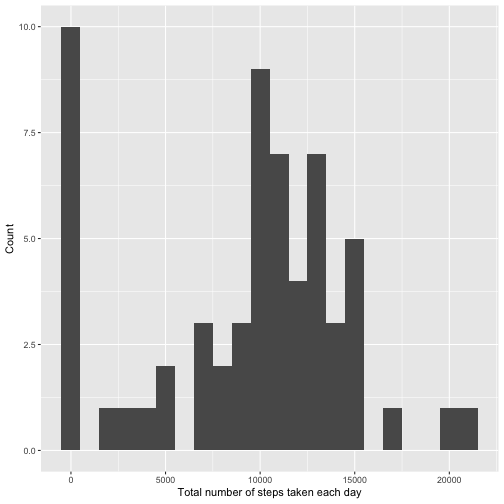
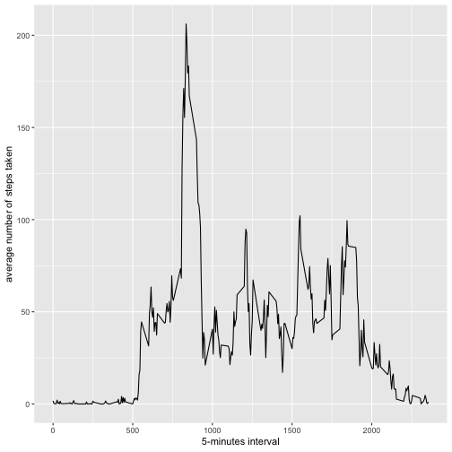
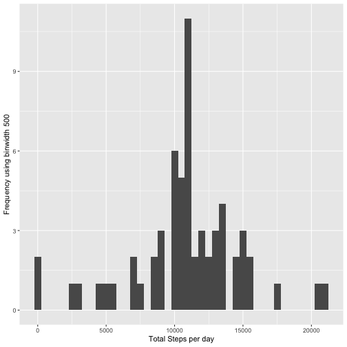
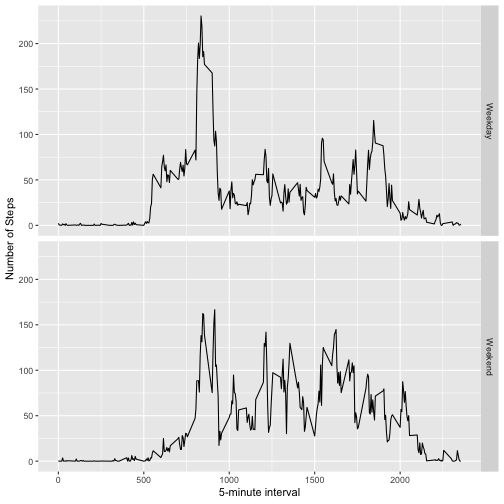

Reproducible Research - Assignment 1
====================================

## Loading and Processing the data

Unzipping and reading the .csv file. First set the present working directory to where the downloaded file is located, using setwd() function.


```r
activity <- unzip('repdata_data_activity.zip')
data <- read.csv("activity.csv", header = TRUE)
```

## Mean total number of steps taken per day

Total number of steps taken per day


```r
library(ggplot2)
total.steps <- tapply(data$steps, data$date, sum, na.rm = TRUE)
```

Histogram of the total number of steps taken each day


```r
qplot(total.steps, binwidth = 1000, xlab = "Total number of steps taken each day", ylab = "Count")
```



Mean and median of the total number of steps taken per day


```r
mean(total.steps, na.rm = TRUE)
```

```
## [1] 9354.23
```

```r
median(total.steps, na.rm = TRUE)
```

```
## [1] 10395
```

## Average daily activity pattern

Time series plot (i.e. type="l") of the 5-minute interval (x-axis) and the average number of steps taken, averaged across all days (y-axis).


```r
library(ggplot2)
average <- aggregate(x = list(steps = data$steps), by = list(interval = data$interval), mean, na.rm = TRUE)
ggplot(average, aes(interval, steps)) + geom_line() + xlab("5-minutes interval") + ylab("average number of steps taken")
```



The 5-minute interval, on average across all the days in the dataset, containing the maximum number of steps is


```r
average[which.max(average$steps), ]
```

```
##     interval    steps
## 104      835 206.1698
```

## Imputing missing data

There are a number of days/intervals where there are missing values (coded as NA). The presence of missing days may introduce bias into some calculations or summaries of the data.


```r
missing_values <- is.na(data$steps)
table(missing_values)
```

```
## missing_values
## FALSE  TRUE 
## 15264  2304
```

All the missing values will be filled with the mean value of 5- minutes interval


```r
stepsaverage <- aggregate(steps ~ interval, data, mean)
filling <- numeric()
for (i in 1:nrow(data)) {
  obs <- data[i, ]
  if (is.na(obs$steps)) {
    steps <- subset(stepsaverage, interval == obs$interval)$steps
  } else {
    steps <- obs$steps
  }
  filling <- c(filling, steps)
}
```

New data that is equal to the original dataset with missing data filled in.


```r
new_data <- data
new_data$steps <- filling
```

Histogram of the total number of steps taken each day


```r
stepsperday <- tapply(new_data$steps, new_data$date, sum)
qplot(stepsperday, binwidth = 500, xlab = "Total Steps per day", ylab = "Frequency using binwidth 500")
```



Calculate and report the mean and median total number of steps taken per day.


```r
mean(stepsperday)
```

```
## [1] 10766.19
```

```r
median(stepsperday)
```

```
## [1] 10766.19
```

Does the mean and median values of imputed data differ from the estimates from the first part of the assignment? Also, what is the impact of imputing missing data on the estimates of the total daily number of steps?


```r
mean(stepsperday) - mean(total.steps, na.rm = TRUE)
```

```
## [1] 1411.959
```

```r
median(stepsperday) - median(total.steps, na.rm = TRUE)
```

```
## [1] 371.1887
```

Yes, the mean and median differ(is higher) after imputing. The impact is calculated as above. 

## Difference in activity patterns between weekdays and weekends

Creating a new factor variable in the dataset with two levels ??? ???weekday??? and ???weekend??? indicating whether a given date is a weekday or weekend day.


```r
new_data$date <- as.Date(as.factor(new_data$date))
day <- weekdays(new_data$date)
daytype <- vector()
for(i in 1:nrow(new_data)) {
  if(day[i] == "Saturday") {
    daytype[i] <- "Weekend"
  } else if(day[i] == "Sunday"){
    daytype[i] <- "Weekend"
  } else {
    daytype[i] <- "Weekday"
  }
}
```

Panel plot containing a time series plot (i.e. type = "l"\color{red}{\verb|type = "l"|}type="l") of the 5-minute interval (x-axis) and the average number of steps taken, averaged across all weekday days or weekend days (y-axis).


```r
stepsbyday <- aggregate(steps ~ interval + daytype, new_data, mean)
ggplot(stepsbyday, aes(interval,steps)) + geom_line() + facet_grid(daytype ~ .) + xlab("5-minute interval") + ylab("Number of Steps")
```


